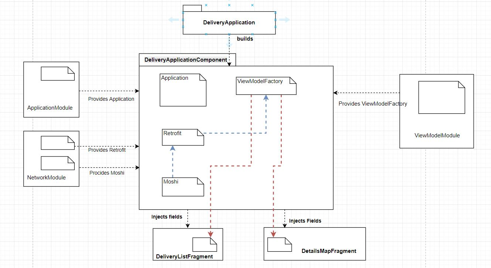

# DeliveryApp
An app with minimalistic UI that shows a list of things to be delivered at a given location and on clicking the list item shows the location in a map and the desicription of the item to be delivered there.
The project has been developed using Android Studio 3.0.1.
The project is designed using android architecture components ViewModel, LifeCycleOwner, Room, LiveData, MediatorLiveData, etc.
The project uses:
It uses:
* Android architecture components Room, LiveData, ViewModel.
* Dagger2 for dependency injection
* RecyclerView.
* Google SupportMapFragment for loading and marking the location on the map.
* Glide for image loading and caching.
* Butterknife for automatic binding of the UI views.
* Retrofit for the web service calls.
* Java version 1.8 compile options for using lambda expressions in the code.
* AutoValue for generating immutable model Pojo objects including the implementation of hashcode and equals methods out of the box.
* AutoValue Moshi extension for serialization and de-serialization from and to the JSON string response that we get from the service call. This is used to provide the necessary converter factory of all the JSON adapters of the AutoValue generated models for the Retrofit library.

## Architecture
It uses the MVVM architecture by introducing an abstraction in each three mainlayers of the application namely Presentation, ViewModel(or Business logic) and the repository for the data layer. The Repository layer seemlessly supplies data either from the webservice layer or local persistence layer. 


## Room
Room is used as an ORM tool to interact between the java and the SQL Lite world.


## Dagger2 Dependency Diagram:


## Package Structure
The packaging structure has been maintained in such a way that all the logical pieces of the application has a package name and their dependency injection related files are placed in the "di" folder as shown in the image below.


## Screenshots


# CI/CD using nevercode.io and HockeyApp (No configuration script required).
### Setting up git repo for the project and clone in nevercode.io console.

### nevercode.io automatically sets up the gradle build environment and dependencies for building the project.

### Build console

### Build log

### Build Artefacts

### Get API Key from the HockeyApp console for distributing the app automatically after build.

### Automatic publishing configuration in the nevercode.io using the API key of the HockeyApp.

### HockeyApp Distribution (automatically distributed from nevercode.io after successful build)


## Code walkthrough

The app fetches 20 items per fetch and loads the pages on demand as the user reaches the end of the scroll in the recycler view. 
This is handled in the recycler view's onScrollListener by calling fetchRepos method on the viewmodel object. 
```java
 listView.addOnScrollListener(new RecyclerView.OnScrollListener() {
            @Override
            public void onScrolled(@NonNull RecyclerView recyclerView, int dx, int dy) {
                super.onScrolled(recyclerView, dx, dy);

                if (dy > 0) //check for scroll down
                {
                    LinearLayoutManager layoutManager = (LinearLayoutManager) recyclerView.getLayoutManager();
                    int visibleItemCount = layoutManager.getChildCount();
                    int totalItemCount = layoutManager.getItemCount();
                    int pastVisiblesItems = layoutManager.findFirstVisibleItemPosition();

                    if (!isLoading && (visibleItemCount + pastVisiblesItems) >= totalItemCount) {
                        isLoading = true;
                        Log.d(TAG, "fetchData called for id:" + id);
                        //Do pagination.. i.e. fetch new data
                        id += ITEMS_COUNT;
                        viewModel.fetchRepos(id, ITEMS_COUNT);
                    }
                }
            }
        });
```
The viewmodel in turn relies on the DeliveryRepository to fetch the repos.
```java
//DeliveriesViewModel.java
  public void fetchRepos(Integer id, Integer items) {
        deliveryRepository.fetch(id, items);

    }
```
The DeliveryRepositotyImpl first queries the LocalDataSource (which queries the RoomDB) if the data already exists. 

```java
//DeliveryRepositoryImpl.java
@Override
    public void fetch(int id, int pageSize) {
        mLoadingMerger.setValue(true);
        mExecutor.execute(() -> {
            List<RepoEntity> repos = mLocalDataSource.fetchByRange(id, pageSize);

            if (repos != null && repos.size() > 0) {
                mDataMerger.postValue(RepoEnityModelMapper.transformEntitiesToModels(mLocalDataSource.getAll()));
                mLoadingMerger.postValue(false);
            } else {
                mRemoteDataSource.fetch(id, pageSize);
            }
        });

    }
```
The LocalDataSource looks in to the DB if the data exists for the range specified.
```java
public List<RepoEntity> fetchByRange(int id, int pageSize) {
        List<RepoEntity> repos = mDb.repoDao().getRepoByRange(id, pageSize);
        return repos;
    }

```

If not, then the data is fetched via the API call in the RemoteDataSource class.
```java
//RemoteDataSource.java
   public void fetch(int id, int pageSize) {
        Call<List<Repo>> repoCall = repoService.getRepositories(id, pageSize);
        repoCall.enqueue(new Callback<List<Repo>>() {
            @Override
            public void onResponse(Call<List<Repo>> call, Response<List<Repo>> response) {
                mError.setValue(false);
                mDataApi.setValue(RepoEnityModelMapper.transformModelsToEntities(response.body()));

            }

            @Override
            public void onFailure(Call<List<Repo>> call, Throwable t) {
                mError.setValue(true);
            }
        });
    }
```

The API call in the RemoteDataSource code snippet shown above, is persisted in the local storage(SQL Lite via Room) and posted to the observers via mDataMerger.post(list) call as shown in the code snippet below.
```java
//DeliveryRepositoryImpl.java
mDataMerger.addSource(this.mRemoteDataSource.getDataStream(), entities ->
                mExecutor.execute(() -> {
                    mLoadingMerger.postValue(true);
                    if (entities != null && entities.size() > 0)
                        mLocalDataSource.writeData(entities);
                })
        );
```
This write operation in the local DB , triggers a LiveData event from the LocalDataSource and handled further in the DelivreyRepositoryImpl.java.
```java
//DeliveryRepositoryImpl.java
mDataMerger.addSource(this.mLocalDataSource.getDataStream(), entities ->
                mExecutor.execute(() -> {
                    List<Repo> models = RepoEnityModelMapper.transformEntitiesToModels(mLocalDataSource.getAll());
                    mDataMerger.postValue(models);
                    mLoadingMerger.postValue(false);

                })

        );
```
"mDataMerger" is an observable LiveData object. So, as soon as it recieves an update  (via the postValue() call), it broadcasts the same to all the observers.

In our case, there are 2 observers: One is the DeliveryListFragment. DeliveryListFragment handles all 3 events when  a new repo is loaded(onRepo), when an error occurs (onError) or when the api has just been called and waiting for it to load (onLoading).
```java
//DeliveryListFragment.java
private void observeViewModel() {
        viewModel.getRepos().observe(this, this::onRepo);
        viewModel.getError().observe(this, this::onError);
        viewModel.getLoading().observe(this, this::onLoading);
    }
```
The other obserever for the same getRepos() livedata is the RepoListAdapter(a RecyclerAdapter) which listens to this event and refeshes the list view with the new data after bind them to the item views.
```java
//RepoListAdapter
 public RepoListAdapter(DeliveriesViewModel viewModel, LifecycleOwner lifecycleOwner, RepoSelectedListener repoSelectedListener) {
        this.repoSelectedListener = repoSelectedListener;
        viewModel.getRepos().observe(lifecycleOwner, repos -> setRepo(repos));
        setHasStableIds(true);
    }
public void setRepo(List<Repo> repos) {
        if (repos == null) {
            data.clear();
            notifyDataSetChanged();
            return;
        }
        DiffUtil.DiffResult diffResult = DiffUtil.calculateDiff(new RepoDiffCallback(data, repos));
        data.clear();
        data.addAll(repos);
        diffResult.dispatchUpdatesTo(this);
    }

```
The DeliveryListFragment implements the onRepoSelected listener which gets triggered when an item is clicked in the list view.
SelectedRepoViewModel is used as a mediator to store the currently selected repo in the list view. It acts as a bridge between the two fragments.
```java
//DeliveryListFragment.java
 @Override
    public void onRepoSelected(Repo repo) {
        SelectedRepoViewModel selectedRepoViewModel = ViewModelProviders.of(getActivity(), viewModelFactory)
                .get(SelectedRepoViewModel.class);
        selectedRepoViewModel.setSelectedRepo(repo);
        getActivity().getSupportFragmentManager().beginTransaction()
                .replace(R.id.frame_container, new DetailsMapFragment())
                .addToBackStack(null)
                .commit();
    }
```
It actually lauches the DetailsMapFragment, which displays the map with the lat and lng marked on it. It also displays the description and the image associated with the item cicked.
During the configuration changes like phone rotation, the current item id state that the fragment has to display may disapper. To handle this, we store the id in onSaveInstanceState method of the fragment and retore it back in the onViewCreated lifecycle method. Based on this id, the item details are fetched back.
```java
//DetailsMapFragment.java
    @Override
    public void onSaveInstanceState(Bundle outState) {
        selectedRepoViewModel.saveToBundle(outState);
    }
```
## Dagger classes:
### NetWorkModule provides the retrofit(for the service calls) and the moshi adapter(for the JSON seraialization and deserializations)
```java
@Module
public abstract class NetworkModule {

    private static final String BASE_URL = "http://mock-api-mobile.dev.lalamove.com";

    @Provides
    @Singleton
    static Moshi provideMoshi() {
        return new Moshi.Builder()
                .add(AdapterFactory.create())
                .build();
    }

    @Provides
    @Singleton
    static Retrofit provideRetrofit(Moshi moshi) {
        return new Retrofit.Builder()
                .baseUrl(BASE_URL)
                .addConverterFactory(MoshiConverterFactory.create(moshi))
                .build();
    }

    @Provides
    @Singleton
    static RepoService provideRepoService(Retrofit retrofit) {
        return retrofit.create(RepoService.class);
    }
}
```
### AcitivityBuilder Module uses the Dagger2 multibinding to bind the factory of the MainActivity with the MainActivity.class as a key.
```java
@Module
public abstract class ActivityBuilder {

    @Binds
    @IntoMap
    @ActivityKey(MainActivity.class)
    abstract AndroidInjector.Factory<? extends Activity> bindMainActivity(MainActivityComponent.Builder builder);
}
```
### MainActivityComponent injects the MainActivity using the factory provided by the ActivityBuilder modlue.
```java

@Subcomponent
public interface MainActivityComponent extends AndroidInjector<MainActivity> {

    @Subcomponent.Builder
    abstract class Builder extends AndroidInjector.Builder<MainActivity> {

        @Override
        public void seedInstance(MainActivity instance) {

        }
    }
}
```
### AppModule includes all the other subcommponents for the application.
```java
@Module(subcomponents = {
        MainActivityComponent.class,
        DeliveryListFragmentComponent.class,
        DetailsMapFragmentComponent.class,
})
class AppModule {

    private final Application application;

    AppModule(Application application) {
        this.application = application;
    }

}
```
### AppComponent takes all the dependencies provided by the modules and injects them in the places requested.
```java
@Singleton
@Component(modules = {
        ActivityBuilder.class,
        FragmentBuilder.class,
        AppModule.class,
        NetworkModule.class,
        ViewModelModule.class,
})
public interface DeliveryApplicationComponent {
    void inject(DeliveryApplication deliveryApplication);

    void inject(DeliveryListFragment listFragment);

    void inject(DetailsMapFragment detailsFragment);

    void inject(MainActivity mainActivity);

    void inject(RepoListAdapter repoListAdapter);

    @Component.Builder
    interface Builder {
        @BindsInstance
        Builder application(Application application);

        DeliveryApplicationComponent build();
    }
}
```
### ViewModelFactory creates the ViewModel that is used by both the DetailsMapFragment and the DeliveryListFragment.
```java
@Singleton
public class ViewModelFactory implements ViewModelProvider.Factory {

    private final Map<Class<? extends ViewModel>, Provider<ViewModel>> viewModels;

    @Inject
    ViewModelFactory(Map<Class<? extends ViewModel>, Provider<ViewModel>> viewModels) {
        this.viewModels = viewModels;
    }

    @NonNull
    @Override
    public <T extends ViewModel> T create(@NonNull Class<T> modelClass) {
        try {
            //noinspection unchecked
            return (T) viewModels.get(modelClass).get();
        } catch (Exception e) {
            throw new RuntimeException("Error creating view model for class: " + modelClass.getSimpleName(), e);
        }
    }
}
```
```java
//DeliveryListFragment.java
  @Override
    public void onViewCreated(View view, @Nullable Bundle savedInstanceState) {
        if (savedInstanceState != null) {
            id = savedInstanceState.getInt("id", 0);
        }
        if (id != 0) isLoadMore = true;
        viewModel = ViewModelProviders.of(this, viewModelFactory).get(DeliveriesViewModel.class);      
```


### ViewModelModule provides the viewmodel object via the Dagger2 MultiBinding 
```java

@Module
public abstract class ViewModelModule {

    @Binds
    @IntoMap
    @ViewModelKey(DeliveriesViewModel.class)
    abstract ViewModel bindProductsViewModel(DeliveriesViewModel viewModel);

    @Binds
    @IntoMap
    @ViewModelKey(SelectedRepoViewModel.class)
    abstract ViewModel bindSelectedRepoViewModel(SelectedRepoViewModel viewModel);

}
```
### DeliveryListFragmentComponent that injects the dependecies for the DeliveryListFragmentComponent.
```java

@Subcomponent
public interface DeliveryListFragmentComponent extends AndroidInjector<DeliveryListFragment> {

    @Subcomponent.Builder
    abstract class Builder extends AndroidInjector.Builder<DeliveryListFragment> {

        @Override
        public void seedInstance(DeliveryListFragment instance) {

        }
    }
}
```


# Contact: sunragav@gmail.com Mobile: +91 8655444565
