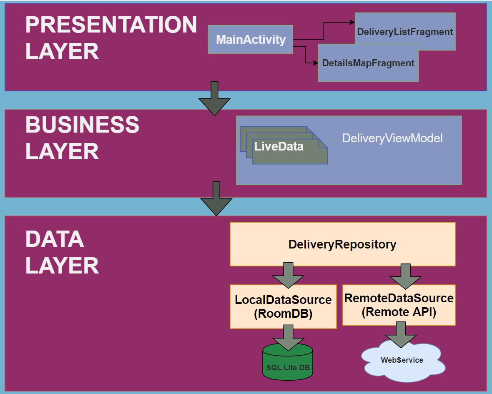
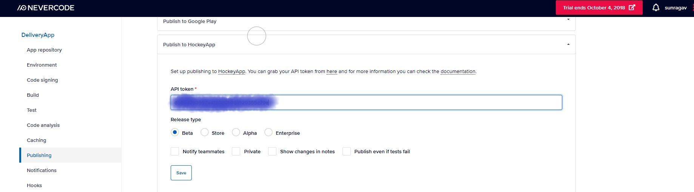

# DeliveryApp
An app with minimalistic UI that shows a list of things to be delivered at a given location and on clicking the list item shows the location in a map and the desicription of the item to be delivered there.
The project has been developed using Android Studio 3.0.1.
The project is designed using android architecture components ViewModel, LifeCycleOwner, Room, LiveData, MediatorLiveData, etc.
The project uses:
It uses:
* Android architecture components Room, LiveData, ViewModel.
* Dagger2 for dependency injection
* RecyclerView.
* Google SupportMapFragment for loading and marking the location on the map.
* Glide for image loading and caching.
* Butterknife for automatic binding of the UI views.
* Retrofit for the web service calls.
* Java version 1.8 compile options for using lambda expressions in the code.
* AutoValue for generating immutable model Pojo objects including the implementation of hashcode and equals methods out of the box.
* AutoValue Moshi extension for serialization and de-serialization from and to the JSON string response that we get from the service call. This is used to provide the necessary converter factory of all the JSON adapters of the AutoValue generated models for the Retrofit library.

## Architecture
It uses the MVVM architecture by introducing an abstraction in each three mainlayers of the application namely Presentation, ViewModel(or Business logic) and the repository for the data layer. The Repository layer seemlessly supplies data either from the webservice layer or local persistence layer. 


## Room
Room is used as an ORM tool to interact between the java and the SQL Lite world.


## Dagger2 Dependency Diagram:


## Screenshots


# CI/CD using nevercode.io and HockeyApp (No configuration script required).
### Setting up git repo for the project and clone in nevercode.io console.

### nevercode.io automatically sets up the gradle build environment and dependencies for building the project.

### Build console

### Build log

### Build succeeds

### Build Artefacts

### Get API Key from the HockeyApp console for distributing the app automatically after build.

### Automatic publishing configuration in the nevercode.io using the API key of the HockeyApp.

### HockeyApp Distribution (automatically distributed from nevercode.io after successful build)


## Code walkthrough
The data is fetched page by page as long as there is a page that exists from the service API. This is done in the RemoteDataSource class.
```java
//RemoteDataSource.java
   public void fetch(int id, int pageSize) {
        Call<List<Repo>> repoCall = repoService.getRepositories(id, pageSize);
        repoCall.enqueue(new Callback<List<Repo>>() {
            @Override
            public void onResponse(Call<List<Repo>> call, Response<List<Repo>> response) {
                mError.setValue(false);
                mDataApi.setValue(RepoEnityModelMapper.transformModelsToEntities(response.body()));

            }

            @Override
            public void onFailure(Call<List<Repo>> call, Throwable t) {
                mError.setValue(true);
            }
        });
    }
```

It fetches 20 items per fetch and loads the pages on demand as the user reaches the end of the scroll in the recycler view. 
This is handled in the recycler view's onScrollListener. 
```java
 listView.addOnScrollListener(new RecyclerView.OnScrollListener() {
            @Override
            public void onScrolled(@NonNull RecyclerView recyclerView, int dx, int dy) {
                super.onScrolled(recyclerView, dx, dy);

                if (dy > 0) //check for scroll down
                {
                    LinearLayoutManager layoutManager = (LinearLayoutManager) recyclerView.getLayoutManager();
                    int visibleItemCount = layoutManager.getChildCount();
                    int totalItemCount = layoutManager.getItemCount();
                    int pastVisiblesItems = layoutManager.findFirstVisibleItemPosition();

                    if (!isLoading && (visibleItemCount + pastVisiblesItems) >= totalItemCount) {
                        isLoading = true;
                        Log.d(TAG, "fetchData called for id:" + id);
                        //Do pagination.. i.e. fetch new data
                        id += ITEMS_COUNT;
                        viewModel.fetchRepos(id, ITEMS_COUNT);
                    }
                }
            }
        });
```

# Contact: sunragav@gmail.com Mobile: +91 8655444565
